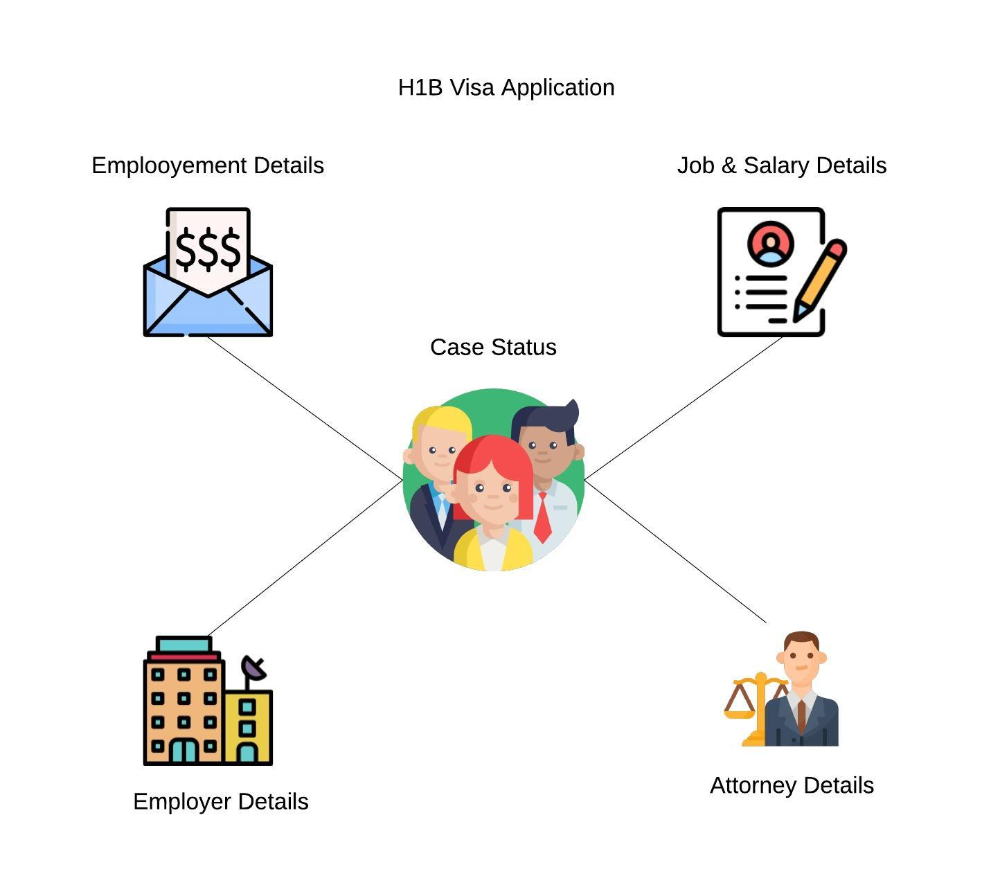

# OFLC Data Analysis
Analysis of H1-B disclosure data from the Office of Foreign Labor Certification. This dataset is interesting because it contains repeated observations of the same variables over 11 years. 

* [Problem Definition](https://github.com/turlapativenkatkrishna/oflc-data-analysis/blob/master/README.md#problem-definition)
* [Data Extraction](https://github.com/turlapativenkatkrishna/oflc-data-analysis/blob/master/README.md#data-extraction)
* [Data Ingestion](https://github.com/turlapativenkatkrishna/oflc-data-analysis/blob/master/README.md#data-ingestion)
* [Data Wrangling/Cleaning](https://github.com/turlapativenkatkrishna/oflc-data-analysis/blob/master/README.md#data-wranglingcleaning)
* [Exploratory Data Analysis](https://github.com/turlapativenkatkrishna/oflc-data-analysis/blob/master/README.md#exploratory-data-analysis)
* [Feature Engineering](https://github.com/turlapativenkatkrishna/oflc-data-analysis/blob/master/README.md#feature-engineering)
* [Base Line Modeling](https://github.com/turlapativenkatkrishna/oflc-data-analysis/blob/master/README.md#base-line-modeling)
* [Model Performance](https://github.com/turlapativenkatkrishna/oflc-data-analysis/blob/master/README.md#model-performance)
* [HyperParameter Tuning](https://github.com/turlapativenkatkrishna/oflc-data-analysis/blob/master/README.md#hyperparameter-tuning) 
* [Model Evaluation]()
* [Interpreation](https://github.com/turlapativenkatkrishna/oflc-data-analysis/blob/master/README.md#interpreation)
* [Model Deployment](https://github.com/turlapativenkatkrishna/oflc-data-analysis/blob/master/README.md#model-deployment)

## Problem Definition

The objective is use the publicly available H1-B disclosure data to build a model that can predict the visa approval status of a H1-B application. The secondary objective is to interpret the results to find which factors influence the approval status. 

## Data Extraction 

The OFLC performance disclosure data can be obtained from this link https://www.foreignlaborcert.doleta.gov/performancedata.cfm. Save the 13 xlsx in a raw or a staging area, couple of columns contain embedded commas its recommened that save the xlsx to csv utf-8 format. Save the converted utf-8 csv's in a seperate folder. 

## Data Ingestion

The thirteen source files are in well defined csv's with headers, the most straight forward way is create a staging table in a RDBMS, I choose Postgres as my data sink. The source ddl's can be found here metadata_munging/ddl. Ingesting data in Postgres is very straight forward, we can leverage `COPY .. FROM ..` construct.   

## Data Wrangling/Cleaning   

Data cleaning is the most crucial part of any data science project. This data set is no different and is messy. Couple of challenges with this data set 

* Normalize field names across all thirteen years 
* Impute missing data
* The key observation prevailing wage or salary can be measured in hourly, weekly, biweekly, monthly or yearly format. 
* Derive additional fields as necessary 
* Create one core table for all data 

**Metadata Munging** 

Original Metadata, viewing the metadata of all 13 files in one layout helps in understanding the schema evolution. Not all fields are consistent and we have new and interesting fields not available for history.  This new fields unfortunately be backfilled. 

| 2008                 | 2009_1               | 2009_2                         | 2010                           | 2011                           | 2012                           | 2013                           | 2014                           | 2015                  | 2016                  | 2017                        | 2018                        | 2019                           |
| -------------------- | -------------------- | ------------------------------ | ------------------------------ | ------------------------------ | ------------------------------ | ------------------------------ | ------------------------------ | --------------------- | --------------------- | --------------------------- | --------------------------- | ------------------------------ |
| SUBMITTED_DATE       | SUBMITTED_DATE       | LCA_CASE_NUMBER                | LCA_CASE_NUMBER                | LCA_CASE_NUMBER                | LCA_CASE_NUMBER                | LCA_CASE_NUMBER                | LCA_CASE_NUMBER                | CASE_NUMBER           | CASE_NUMBER           | CASE_NUMBER                 | CASE_NUMBER                 | CASE_NUMBER                    |
| CASE_NO              | CASE_NO              | STATUS                         | STATUS                         | STATUS                         | STATUS                         | STATUS                         | STATUS                         | CASE_STATUS           | CASE_STATUS           | CASE_STATUS                 | CASE_STATUS                 | CASE_STATUS                    |
| PROGRAM              | PROGRAM_DESIGNATION  | LCA_CASE_SUBMIT                | LCA_CASE_SUBMIT                | LCA_CASE_SUBMIT                | LCA_CASE_SUBMIT                | LCA_CASE_SUBMIT                | LCA_CASE_SUBMIT                | CASE_SUBMITTED        | CASE_SUBMITTED        | CASE_SUBMITTED              | CASE_SUBMITTED              | CASE_SUBMITTED                 |
| NAME                 | EMPLOYER_NAME        | Decision_Date                  | DECISION_DATE                  | DECISION_DATE                  | DECISION_DATE                  | Decision_Date                  | DECISION_DATE                  | DECISION_DATE         | DECISION_DATE         | DECISION_DATE               | DECISION_DATE               | DECISION_DATE                  |
| ADDRESS1             | EMPLOYER_ADDRESS1    | VISA_CLASS                     | LCA_CASE_EMPLOYMENT_START_DATE | VISA_CLASS                     | VISA_CLASS                     | VISA_CLASS                     | VISA_CLASS                     | VISA_CLASS            | VISA_CLASS            | VISA_CLASS                  | VISA_CLASS                  | VISA_CLASS                     |
| ADDRESS2             | EMPLOYER_ADDRESS2    | LCA_CASE_EMPLOYMENT_START_DATE | LCA_CASE_EMPLOYMENT_END_DATE   | LCA_CASE_EMPLOYMENT_START_DATE | LCA_CASE_EMPLOYMENT_START_DATE | LCA_CASE_EMPLOYMENT_START_DATE | LCA_CASE_EMPLOYMENT_START_DATE | EMPLOYMENT_START_DATE | EMPLOYMENT_START_DATE | EMPLOYMENT_START_DATE       | EMPLOYMENT_START_DATE       | EMPLOYMENT_START_DATE          |
| CITY                 | EMPLOYER_CITY        | LCA_CASE_EMPLOYMENT_END_DATE   | LCA_CASE_EMPLOYER_NAME         | LCA_CASE_EMPLOYMENT_END_DATE   | LCA_CASE_EMPLOYMENT_END_DATE   | LCA_CASE_EMPLOYMENT_END_DATE   | LCA_CASE_EMPLOYMENT_END_DATE   | EMPLOYMENT_END_DATE   | EMPLOYMENT_END_DATE   | EMPLOYMENT_END_DATE         | EMPLOYMENT_END_DATE         | EMPLOYMENT_END_DATE            |
| STATE                | EMPLOYER_STATE       | LCA_CASE_EMPLOYER_NAME         | LCA_CASE_EMPLOYER_ADDRESS1     | LCA_CASE_EMPLOYER_NAME         | LCA_CASE_EMPLOYER_NAME         | LCA_CASE_EMPLOYER_NAME         | LCA_CASE_EMPLOYER_NAME         | EMPLOYER_NAME         | EMPLOYER_NAME         | EMPLOYER_NAME               | EMPLOYER_NAME               | EMPLOYER_NAME                  |
| POSTAL_CODE          | EMPLOYER_COUNTY      | LCA_CASE_EMPLOYER_ADDRESS      | LCA_CASE_EMPLOYER_ADDRESS2     | LCA_CASE_EMPLOYER_ADDRESS      | LCA_CASE_EMPLOYER_ADDRESS      | LCA_CASE_EMPLOYER_ADDRESS      | LCA_CASE_EMPLOYER_ADDRESS      | EMPLOYER_ADDRESS1     | EMPLOYER_ADDRESS      | EMPLOYER_BUSINESS_DBA       | EMPLOYER_BUSINESS_DBA       | EMPLOYER_BUSINESS_DBA          |
| NBR_IMMIGRANTS       | EMPLOYER_POSTAL_CODE | LCA_CASE_EMPLOYER_CITY         | LCA_CASE_EMPLOYER_CITY         | LCA_CASE_EMPLOYER_CITY         | LCA_CASE_EMPLOYER_CITY         | LCA_CASE_EMPLOYER_CITY         | LCA_CASE_EMPLOYER_CITY         | EMPLOYER_ADDRESS2     | EMPLOYER_CITY         | EMPLOYER_ADDRESS            | EMPLOYER_ADDRESS            | EMPLOYER_ADDRESS               |
| BEGIN_DATE           | NBR_IMMIGRANTS       | LCA_CASE_EMPLOYER_STATE        | LCA_CASE_EMPLOYER_STATE        | LCA_CASE_EMPLOYER_STATE        | LCA_CASE_EMPLOYER_STATE        | LCA_CASE_EMPLOYER_STATE        | LCA_CASE_EMPLOYER_STATE        | EMPLOYER_CITY         | EMPLOYER_STATE        | EMPLOYER_CITY               | EMPLOYER_CITY               | EMPLOYER_CITY                  |
| END_DATE             | BEGIN_DATE           | LCA_CASE_EMPLOYER_POSTAL_CODE  | LCA_CASE_EMPLOYER_POSTAL_CODE  | LCA_CASE_EMPLOYER_POSTAL_CODE  | LCA_CASE_EMPLOYER_POSTAL_CODE  | LCA_CASE_EMPLOYER_POSTAL_CODE  | LCA_CASE_EMPLOYER_POSTAL_CODE  | EMPLOYER_STATE        | EMPLOYER_POSTAL_CODE  | EMPLOYER_STATE              | EMPLOYER_STATE              | EMPLOYER_STATE                 |
| JOB_TITLE            | END_DATE             | LCA_CASE_SOC_CODE              | LCA_CASE_SOC_CODE              | LCA_CASE_SOC_CODE              | LCA_CASE_SOC_CODE              | LCA_CASE_SOC_CODE              | LCA_CASE_SOC_CODE              | EMPLOYER_POSTAL_CODE  | EMPLOYER_COUNTRY      | EMPLOYER_POSTAL_CODE        | EMPLOYER_POSTAL_CODE        | EMPLOYER_POSTAL_CODE           |
| DOL_DECISION_DATE    | JOB_TITLE            | LCA_CASE_SOC_NAME              | LCA_CASE_SOC_NAME              | LCA_CASE_SOC_NAME              | LCA_CASE_SOC_NAME              | LCA_CASE_SOC_NAME              | LCA_CASE_SOC_NAME              | EMPLOYER_COUNTRY      | EMPLOYER_PROVINCE     | EMPLOYER_COUNTRY            | EMPLOYER_COUNTRY            | EMPLOYER_COUNTRY               |
| CERTIFIED_BEGIN_DATE | DOL_DECISION_DATE    | LCA_CASE_JOB_TITLE             | LCA_CASE_JOB_TITLE             | LCA_CASE_JOB_TITLE             | LCA_CASE_JOB_TITLE             | LCA_CASE_JOB_TITLE             | LCA_CASE_JOB_TITLE             | EMPLOYER_PROVINCE     | EMPLOYER_PHONE        | EMPLOYER_PROVINCE           | EMPLOYER_PROVINCE           | EMPLOYER_PROVINCE              |
| CERTIFIED_END_DATE   | OCCUPATIONAL_CODE    | LCA_CASE_WAGE_RATE_FROM        | LCA_CASE_WAGE_RATE_FROM        | LCA_CASE_WAGE_RATE_FROM        | LCA_CASE_WAGE_RATE_FROM        | LCA_CASE_WAGE_RATE_FROM        | LCA_CASE_WAGE_RATE_FROM        | EMPLOYER_PHONE        | EMPLOYER_PHONE_EXT    | EMPLOYER_PHONE              | EMPLOYER_PHONE              | EMPLOYER_PHONE                 |
| JOB_CODE             | OCCUPATIONAL_TITLE   | LCA_CASE_WAGE_RATE_TO          | LCA_CASE_WAGE_RATE_TO          | LCA_CASE_WAGE_RATE_TO          | LCA_CASE_WAGE_RATE_TO          | LCA_CASE_WAGE_RATE_TO          | LCA_CASE_WAGE_RATE_TO          | EMPLOYER_PHONE_EXT    | AGENT_ATTORNEY_NAME   | EMPLOYER_PHONE_EXT          | EMPLOYER_PHONE_EXT          | EMPLOYER_PHONE_EXT             |
| APPROVAL_STATUS      | APPROVAL_STATUS      | LCA_CASE_WAGE_RATE_UNIT        | TOTAL_WORKERS                  | LCA_CASE_WAGE_RATE_UNIT        | LCA_CASE_WAGE_RATE_UNIT        | LCA_CASE_WAGE_RATE_UNIT        | LCA_CASE_WAGE_RATE_UNIT        | AGENT_ATTORNEY_NAME   | AGENT_ATTORNEY_CITY   | AGENT_REPRESENTING_EMPLOYER | AGENT_REPRESENTING_EMPLOYER | SECONDARY_ENTITY               |
| WAGE_RATE_1          | WAGE_RATE_1          | FULL_TIME_POS                  | WORK_LOCATION_CITY1            | FULL_TIME_POS                  | FULL_TIME_POS                  | FULL_TIME_POS                  | FULL_TIME_POS                  | AGENT_ATTORNEY_CITY   | AGENT_ATTORNEY_STATE  | AGENT_ATTORNEY_NAME         | AGENT_ATTORNEY_NAME         | SECONDARY_ENTITY_BUSINESS_NAME |
| RATE_PER_1           | RATE_PER_1           | TOTAL_WORKERS                  | WORK_LOCATION_STATE1           | TOTAL_WORKERS                  | TOTAL_WORKERS                  | TOTAL_WORKERS                  | TOTAL_WORKERS                  | AGENT_ATTORNEY_STATE  | JOB_TITLE             | AGENT_ATTORNEY_CITY         | AGENT_ATTORNEY_CITY         | AGENT_REPRESENTING_EMPLOYER    |
| MAX_RATE_1           | MAX_RATE_1           | LCA_CASE_WORKLOC1_CITY         | PW_1                           | LCA_CASE_WORKLOC1_CITY         | LCA_CASE_WORKLOC1_CITY         | LCA_CASE_WORKLOC1_CITY         | LCA_CASE_WORKLOC1_CITY         | JOB_TITLE             | SOC_CODE              | AGENT_ATTORNEY_STATE        | AGENT_ATTORNEY_STATE        | AGENT_ATTORNEY_NAME            |
| PART_TIME_1          | PART_TIME_1          | LCA_CASE_WORKLOC1_STATE        | PW_UNIT_1                      | LCA_CASE_WORKLOC1_STATE        | LCA_CASE_WORKLOC1_STATE        | LCA_CASE_WORKLOC1_STATE        | LCA_CASE_WORKLOC1_STATE        | SOC_CODE              | SOC_NAME              | JOB_TITLE                   | JOB_TITLE                   | AGENT_ATTORNEY_CITY            |
| CITY_1               | CITY_1               | PW_1                           | PW_SOURCE_1                    | PW_1                           | PW_1                           | PW_1                           | PW_1                           | SOC_NAME              | NAIC_CODE             | SOC_CODE                    | SOC_CODE                    | AGENT_ATTORNEY_STATE           |
| STATE_1              | STATE_1              | PW_UNIT_1                      | OTHER_WAGE_SOURCE_1            | PW_UNIT_1                      | PW_UNIT_1                      | PW_UNIT_1                      | PW_UNIT_1                      | NAIC_CODE             | TOTAL_WORKERS         | SOC_NAME                    | SOC_NAME                    | JOB_TITLE                      |
| PREVAILING_WAGE_1    | PREVAILING_WAGE_1    | PW_SOURCE_1                    | YR_SOURCE_PUB_1                | PW_SOURCE_1                    | PW_SOURCE_1                    | PW_SOURCE_1                    | PW_SOURCE_1                    | TOTAL                 | FULL_TIME_POSITION    | NAICS_CODE                  | NAICS_CODE                  | SOC_CODE                       |
| WAGE_SOURCE_1        | WAGE_SOURCE_1        | OTHER_WAGE_SOURCE_1            | WORK_LOCATION_CITY2            | OTHER_WAGE_SOURCE_1            | OTHER_WAGE_SOURCE_1            | OTHER_WAGE_SOURCE_1            | OTHER_WAGE_SOURCE_1            | WORKERS               | PREVAILING_WAGE       | TOTAL_WORKERS               | TOTAL_WORKERS               | SOC_NAME                       |
| YR_SOURCE_PUB_1      | YR_SOURCE_PUB_1      | YR_SOURCE_PUB_1                | WORK_LOCATION_STATE2           | YR_SOURCE_PUB_1                | YR_SOURCE_PUB_1                | YR_SOURCE_PUB_1                | YR_SOURCE_PUB_1                | FULL_TIME_POSITION    | PW_UNIT_OF_PAY        | NEW_EMPLOYMENT              | NEW_EMPLOYMENT              | NAICS_CODE                     |
| OTHER_WAGE_SOURCE_1  | OTHER_WAGE_SOURCE_1  | LCA_CASE_WORKLOC2_CITY         | PW_2                           | LCA_CASE_WORKLOC2_CITY         | LCA_CASE_WORKLOC2_CITY         | LCA_CASE_WORKLOC2_CITY         | LCA_CASE_WORKLOC2_CITY         | PREVAILING_WAGE       | PW_WAGE_SOURCE        | CONTINUED_EMPLOYMENT        | CONTINUED_EMPLOYMENT        | TOTAL_WORKERS                  |
| WAGE_RATE_2          | WAGE_RATE__2         | LCA_CASE_WORKLOC2_STATE        | PW_UNIT_2                      | LCA_CASE_WORKLOC2_STATE        | LCA_CASE_WORKLOC2_STATE        | LCA_CASE_WORKLOC2_STATE        | LCA_CASE_WORKLOC2_STATE        | PW_UNIT_OF_PAY        | PW_SOURCE_YEAR        | CHANGE_PREVIOUS_EMPLOYMENT  | CHANGE_PREVIOUS_EMPLOYMENT  | NEW_EMPLOYMENT                 |
| RATE_PER_2           | RATE_PER_2           | PW_2                           | PW_SOURCE_2                    | PW_2                           | PW_2                           | PW_2                           | PW_2                           | PW_WAGE_LEVEL         | PW_SOURCE_OTHER       | NEW_CONCURRENT_EMPLOYMENT   | NEW_CONCURRENT_EMP          | CONTINUED_EMPLOYMENT           |
| MAX_RATE_2           | MAX_RATE_2           | PW_UNIT_2                      | OTHER_WAGE_SOURCE_2            | PW_UNIT_2                      | PW_UNIT_2                      | PW_UNIT_2                      | PW_UNIT_2                      | PW_WAGE_SOURCE        | WAGE_RATE_OF_PAY_FROM | CHANGE_EMPLOYER             | CHANGE_EMPLOYER             | CHANGE_PREVIOUS_EMPLOYMENT     |
| PART_TIME_2          | PART_TIME_2          | PW_SOURCE_2                    | YR_SOURCE_PUB_2                | PW_SOURCE_2                    | PW_SOURCE_2                    | PW_SOURCE_2                    | PW_SOURCE_2                    | PW_WAGE_SOURCE_YEAR   | WAGE_RATE_OF_PAY_TO   | AMENDED_PETITION            | AMENDED_PETITION            | NEW_CONCURRENT_EMP             |
| CITY_2               | CITY_2               | OTHER_WAGE_SOURCE_2            | LCA_CASE_NAICS_CODE            | OTHER_WAGE_SOURCE_2            | OTHER_WAGE_SOURCE_2            | OTHER_WAGE_SOURCE_2            | OTHER_WAGE_SOURCE_2            | PW_WAGE_SOURCE_OTHER  | WAGE_UNIT_OF_PAY      | FULL_TIME_POSITION          | FULL_TIME_POSITION          | CHANGE_EMPLOYER                |
| STATE_2              | STATE_2              | YR_SOURCE_PUB_2                |                                | YR_SOURCE_PUB_2                | YR_SOURCE_PUB_2                | YR_SOURCE_PUB_2                | YR_SOURCE_PUB_2                | WAGE_RATE_OF_PAY      | H-1B_DEPENDENT        | PREVAILING_WAGE             | PREVAILING_WAGE             | AMENDED_PETITION               |
| PREVAILING_WAGE_2    | PREVAILING_WAGE_2    | LCA_CASE_NAICS_CODE            |                                | LCA_CASE_NAICS_CODE            | LCA_CASE_NAICS_CODE            | LCA_CASE_NAICS_CODE            | LCA_CASE_NAICS_CODE            | WAGE_UNIT_OF_PAY      | WILLFUL_VIOLATOR      | PW_UNIT_OF_PAY              | PW_UNIT_OF_PAY              | FULL_TIME_POSITION             |
| WAGE_SOURCE_2        | WAGE_SOURCE_2        |                                |                                |                                |                                |                                |                                | H-1B_DEPENDENT        | WORKSITE_CITY         | PW_WAGE_LEVEL               | PW_WAGE_LEVEL               | PREVAILING_WAGE                |
| YR_SOURCE_PUB_2      | YR_SOURCE_PUB_2      |                                |                                |                                |                                |                                |                                | WILLFUL               | WORKSITE_COUNTY       | PW_SOURCE                   | PW_SOURCE                   | PW_UNIT_OF_PAY                 |
| OTHER_WAGE_SOURCE_2  | OTHER_WAGE_SOURCE_2  |                                |                                |                                |                                |                                |                                | VIOLATOR              | WORKSITE_STATE        | PW_SOURCE_YEAR              | PW_SOURCE_YEAR              | PW_WAGE_LEVEL                  |
| WITHDRAWN            | WITHDRAWN            |                                |                                |                                |                                |                                |                                | WORKSITE_CITY         | WORKSITE_POSTAL_CODE  | PW_SOURCE_OTHER             | PW_SOURCE_OTHER             | PW_SOURCE                      |
| OCCUPATIONAL_TITLE   |                      |                                |                                |                                |                                |                                |                                | WORKSITE_COUNTY       | ORIGINAL_CERT_DATE    | WAGE_RATE_OF_PAY_FROM       | WAGE_RATE_OF_PAY_FROM       | PW_SOURCE_YEAR                 |
|                      |                      |                                |                                |                                |                                |                                |                                | WORKSITE_STATE        |                       | WAGE_RATE_OF_PAY_TO         | WAGE_RATE_OF_PAY_TO         | PW_SOURCE_OTHER                |
|                      |                      |                                |                                |                                |                                |                                |                                | WORKSITE_POSTAL_CODE  |                       | WAGE_UNIT_OF_PAY            | WAGE_UNIT_OF_PAY            | WAGE_RATE_OF_PAY_FROM          |
|                      |                      |                                |                                |                                |                                |                                |                                |                       |                       | H1B_DEPENDENT               | H1B_DEPENDENT               | WAGE_RATE_OF_PAY_TO            |
|                      |                      |                                |                                |                                |                                |                                |                                |                       |                       | WILLFUL_VIOLATOR            | WILLFUL_VIOLATOR            | WAGE_UNIT_OF_PAY               |
|                      |                      |                                |                                |                                |                                |                                |                                |                       |                       | SUPPORT_H1B                 | SUPPORT_H1B                 | H1B_DEPENDENT                  |
|                      |                      |                                |                                |                                |                                |                                |                                |                       |                       | LABOR_CON_AGREE             | LABOR_CON_AGREE             | WILLFUL_VIOLATOR               |
|                      |                      |                                |                                |                                |                                |                                |                                |                       |                       | PUBLIC_DISCLOSURE_LOCATION  | PUBLIC_DISCLOSURE_LOCATION  | SUPPORT_H1B                    |
|                      |                      |                                |                                |                                |                                |                                |                                |                       |                       | WORKSITE_CITY               | WORKSITE_CITY               | STATUTORY_BASIS                |
|                      |                      |                                |                                |                                |                                |                                |                                |                       |                       | WORKSITE_COUNTY             | WORKSITE_COUNTY             | APPENDIX_ATTACHMENT            |
|                      |                      |                                |                                |                                |                                |                                |                                |                       |                       | WORKSITE_STATE              | WORKSITE_STATE              | LABOR_CON_AGREE                |
|                      |                      |                                |                                |                                |                                |                                |                                |                       |                       | WORKSITE_POSTAL_CODE        | WORKSITE_POSTAL_CODE        | PUBLIC_DISCLOSURE_LOCATION     |
|                      |                      |                                |                                |                                |                                |                                |                                |                       |                       | ORIGINAL_CERT_DATE          | ORIGINAL_CERT_DATE          | WORKSITE_CITY                  |
|                      |                      |                                |                                |                                |                                |                                |                                |                       |                       |                             |                             | WORKSITE_COUNTY                |
|                      |                      |                                |                                |                                |                                |                                |                                |                       |                       |                             |                             | WORKSITE_STATE                 |
|                      |                      |                                |                                |                                |                                |                                |                                |                       |                       |                             |                             | WORKSITE_POSTAL_CODE           |
|                      |                      |                                |                                |                                |                                |                                |                                |                       |                       |                             |                             | ORIGINAL_CERT_DATE             |

After reviewing the data dictionary for all thirteen files, here is a consolidated view 

| 2008                      | 2009_1                   | 2009_2                         | 2010                           | 2011                           | 2012                           | 2013                           | 2014                           | 2015                  | 2016                  | 2017                        | 2018                        | 2019                           |
| ------------------------- | ------------------------ | ------------------------------ | ------------------------------ | ------------------------------ | ------------------------------ | ------------------------------ | ------------------------------ | --------------------- | --------------------- | --------------------------- | --------------------------- | ------------------------------ |
| CASE_NO                   | CASE_NO                  | LCA_CASE_NUMBER                | LCA_CASE_NUMBER                | LCA_CASE_NUMBER                | LCA_CASE_NUMBER                | LCA_CASE_NUMBER                | LCA_CASE_NUMBER                | CASE_NUMBER           | CASE_NUMBER           | CASE_NUMBER                 | CASE_NUMBER                 | CASE_NUMBER                    |
| APPROVAL_STATUS           | APPROVAL_STATUS          | STATUS                         | STATUS                         | STATUS                         | STATUS                         | STATUS                         | STATUS                         | CASE_STATUS           | CASE_STATUS           | CASE_STATUS                 | CASE_STATUS                 | CASE_STATUS                    |
| SUBMITTED_DATE            | SUBMITTED_DATE           | LCA_CASE_SUBMIT                | LCA_CASE_SUBMIT                | LCA_CASE_SUBMIT                | LCA_CASE_SUBMIT                | LCA_CASE_SUBMIT                | LCA_CASE_SUBMIT                | CASE_SUBMITTED        | CASE_SUBMITTED        | CASE_SUBMITTED              | CASE_SUBMITTED              | CASE_SUBMITTED                 |
| DOL_DECISION_DATE         | DOL_DECISION_DATE        | Decision_Date                  | DECISION_DATE                  | DECISION_DATE                  | DECISION_DATE                  | Decision_Date                  | DECISION_DATE                  | DECISION_DATE         | DECISION_DATE         | DECISION_DATE               | DECISION_DATE               | DECISION_DATE                  |
| PROGRAM                   | PROGRAM_DESIGNATION      | VISA_CLASS                     |                                | VISA_CLASS                     | VISA_CLASS                     | VISA_CLASS                     | VISA_CLASS                     | VISA_CLASS            | VISA_CLASS            | VISA_CLASS                  | VISA_CLASS                  | VISA_CLASS                     |
| BEGIN_DATE                | BEGIN_DATE               | LCA_CASE_EMPLOYMENT_START_DATE | LCA_CASE_EMPLOYMENT_START_DATE | LCA_CASE_EMPLOYMENT_START_DATE | LCA_CASE_EMPLOYMENT_START_DATE | LCA_CASE_EMPLOYMENT_START_DATE | LCA_CASE_EMPLOYMENT_START_DATE | EMPLOYMENT_START_DATE | EMPLOYMENT_START_DATE | EMPLOYMENT_START_DATE       | EMPLOYMENT_START_DATE       | EMPLOYMENT_START_DATE          |
| END_DATE                  | END_DATE                 | LCA_CASE_EMPLOYMENT_END_DATE   | LCA_CASE_EMPLOYMENT_END_DATE   | LCA_CASE_EMPLOYMENT_END_DATE   | LCA_CASE_EMPLOYMENT_END_DATE   | LCA_CASE_EMPLOYMENT_END_DATE   | LCA_CASE_EMPLOYMENT_END_DATE   | EMPLOYMENT_END_DATE   | EMPLOYMENT_END_DATE   | EMPLOYMENT_END_DATE         | EMPLOYMENT_END_DATE         | EMPLOYMENT_END_DATE            |
| NAME                      | EMPLOYER_NAME            | LCA_CASE_EMPLOYER_NAME         | LCA_CASE_EMPLOYER_NAME         | LCA_CASE_EMPLOYER_NAME         | LCA_CASE_EMPLOYER_NAME         | LCA_CASE_EMPLOYER_NAME         | LCA_CASE_EMPLOYER_NAME         | EMPLOYER_NAME         | EMPLOYER_NAME         | EMPLOYER_NAME               | EMPLOYER_NAME               | EMPLOYER_NAME                  |
|                           |                          |                                |                                |                                |                                |                                |                                | EMPLOYER_ADDRESS1     |                       | EMPLOYER_BUSINESS_DBA       | EMPLOYER_BUSINESS_DBA       | EMPLOYER_BUSINESS_DBA          |
| ADDRESS1                  | EMPLOYER_ADDRESS1        | LCA_CASE_EMPLOYER_ADDRESS      | LCA_CASE_EMPLOYER_ADDRESS1     | LCA_CASE_EMPLOYER_ADDRESS      | LCA_CASE_EMPLOYER_ADDRESS      | LCA_CASE_EMPLOYER_ADDRESS      | LCA_CASE_EMPLOYER_ADDRESS      | EMPLOYER_ADDRESS2     | EMPLOYER_ADDRESS      | EMPLOYER_ADDRESS            | EMPLOYER_ADDRESS            | EMPLOYER_ADDRESS               |
| CITY                      | EMPLOYER_CITY            | LCA_CASE_EMPLOYER_CITY         | LCA_CASE_EMPLOYER_CITY         | LCA_CASE_EMPLOYER_CITY         | LCA_CASE_EMPLOYER_CITY         | LCA_CASE_EMPLOYER_CITY         | LCA_CASE_EMPLOYER_CITY         | EMPLOYER_CITY         | EMPLOYER_CITY         | EMPLOYER_CITY               | EMPLOYER_CITY               | EMPLOYER_CITY                  |
| STATE                     | EMPLOYER_STATE           | LCA_CASE_EMPLOYER_STATE        | LCA_CASE_EMPLOYER_STATE        | LCA_CASE_EMPLOYER_STATE        | LCA_CASE_EMPLOYER_STATE        | LCA_CASE_EMPLOYER_STATE        | LCA_CASE_EMPLOYER_STATE        | EMPLOYER_STATE        | EMPLOYER_STATE        | EMPLOYER_STATE              | EMPLOYER_STATE              | EMPLOYER_STATE                 |
| POSTAL_CODE               | EMPLOYER_POSTAL_CODE     | LCA_CASE_EMPLOYER_POSTAL_CODE  | LCA_CASE_EMPLOYER_POSTAL_CODE  | LCA_CASE_EMPLOYER_POSTAL_CODE  | LCA_CASE_EMPLOYER_POSTAL_CODE  | LCA_CASE_EMPLOYER_POSTAL_CODE  | LCA_CASE_EMPLOYER_POSTAL_CODE  | EMPLOYER_POSTAL_CODE  | EMPLOYER_POSTAL_CODE  | EMPLOYER_POSTAL_CODE        | EMPLOYER_POSTAL_CODE        | EMPLOYER_POSTAL_CODE           |
|                           |                          |                                |                                |                                |                                |                                |                                | EMPLOYER_COUNTRY      | EMPLOYER_COUNTRY      | EMPLOYER_COUNTRY            | EMPLOYER_COUNTRY            | EMPLOYER_COUNTRY               |
|                           |                          |                                |                                |                                |                                |                                |                                | EMPLOYER_PROVINCE     | EMPLOYER_PROVINCE     | EMPLOYER_PROVINCE           | EMPLOYER_PROVINCE           | EMPLOYER_PROVINCE              |
|                           |                          |                                |                                |                                |                                |                                |                                | EMPLOYER_PHONE        | EMPLOYER_PHONE        | EMPLOYER_PHONE              | EMPLOYER_PHONE              | EMPLOYER_PHONE                 |
|                           |                          |                                |                                |                                |                                |                                |                                | EMPLOYER_PHONE_EXT    | EMPLOYER_PHONE_EXT    | EMPLOYER_PHONE_EXT          | EMPLOYER_PHONE_EXT          | EMPLOYER_PHONE_EXT             |
|                           |                          |                                |                                |                                |                                |                                |                                |                       |                       |                             |                             | SECONDARY_ENTITY               |
|                           |                          |                                |                                |                                |                                |                                |                                |                       |                       |                             |                             | SECONDARY_ENTITY_BUSINESS_NAME |
|                           |                          |                                |                                |                                |                                |                                |                                |                       |                       | AGENT_REPRESENTING_EMPLOYER | AGENT_REPRESENTING_EMPLOYER | AGENT_REPRESENTING_EMPLOYER    |
|                           |                          |                                | WORK_LOCATION_CITY1            |                                |                                |                                |                                | AGENT_ATTORNEY_NAME   | AGENT_ATTORNEY_NAME   | AGENT_ATTORNEY_NAME         | AGENT_ATTORNEY_NAME         | AGENT_ATTORNEY_NAME            |
|                           |                          |                                | WORK_LOCATION_STATE1           |                                |                                |                                |                                | AGENT_ATTORNEY_CITY   | AGENT_ATTORNEY_CITY   | AGENT_ATTORNEY_CITY         | AGENT_ATTORNEY_CITY         | AGENT_ATTORNEY_CITY            |
|                           |                          |                                |                                |                                |                                |                                |                                | AGENT_ATTORNEY_STATE  | AGENT_ATTORNEY_STATE  | AGENT_ATTORNEY_STATE        | AGENT_ATTORNEY_STATE        | AGENT_ATTORNEY_STATE           |
| OCCUPATIONAL_TITLE        | OCCUPATIONAL_TITLE       | LCA_CASE_JOB_TITLE             | LCA_CASE_JOB_TITLE             | LCA_CASE_JOB_TITLE             | LCA_CASE_JOB_TITLE             | LCA_CASE_JOB_TITLE             | LCA_CASE_JOB_TITLE             | JOB_TITLE             | JOB_TITLE             | JOB_TITLE                   | JOB_TITLE                   | JOB_TITLE                      |
| JOB_CODE                  | OCCUPATIONAL_CODE        | LCA_CASE_SOC_CODE              | LCA_CASE_SOC_CODE              | LCA_CASE_SOC_CODE              | LCA_CASE_SOC_CODE              | LCA_CASE_SOC_CODE              | LCA_CASE_SOC_CODE              | SOC_CODE              | SOC_CODE              | SOC_CODE                    | SOC_CODE                    | SOC_CODE                       |
|                           |                          | LCA_CASE_SOC_NAME              | LCA_CASE_SOC_NAME              | LCA_CASE_SOC_NAME              | LCA_CASE_SOC_NAME              | LCA_CASE_SOC_NAME              | LCA_CASE_SOC_NAME              | SOC_NAME              | SOC_NAME              | SOC_NAME                    | SOC_NAME                    | SOC_NAME                       |
|                           |                          | LCA_CASE_NAICS_CODE            | LCA_CASE_NAICS_CODE            | LCA_CASE_NAICS_CODE            | LCA_CASE_NAICS_CODE            | LCA_CASE_NAICS_CODE            | LCA_CASE_NAICS_CODE            | NAIC_CODE             | NAIC_CODE             | NAICS_CODE                  | NAICS_CODE                  | NAICS_CODE                     |
|                           |                          | TOTAL_WORKERS                  | TOTAL_WORKERS                  | TOTAL_WORKERS                  | TOTAL_WORKERS                  | TOTAL_WORKERS                  | TOTAL_WORKERS                  | TOTAL_WORKERS         | TOTAL_WORKERS         | TOTAL_WORKERS               | TOTAL_WORKERS               | TOTAL_WORKERS                  |
|                           |                          |                                |                                |                                |                                |                                |                                |                       |                       | NEW_EMPLOYMENT              | NEW_EMPLOYMENT              | NEW_EMPLOYMENT                 |
|                           |                          |                                |                                |                                |                                |                                |                                |                       |                       | CONTINUED_EMPLOYMENT        | CONTINUED_EMPLOYMENT        | CONTINUED_EMPLOYMENT           |
|                           |                          |                                |                                |                                |                                |                                |                                |                       |                       | CHANGE_PREVIOUS_EMPLOYMENT  | CHANGE_PREVIOUS_EMPLOYMENT  | CHANGE_PREVIOUS_EMPLOYMENT     |
|                           |                          |                                |                                |                                |                                |                                |                                |                       |                       | NEW_CONCURRENT_EMPLOYMENT   | NEW_CONCURRENT_EMP          | NEW_CONCURRENT_EMP             |
|                           |                          |                                |                                |                                |                                |                                |                                |                       |                       | CHANGE_EMPLOYER             | CHANGE_EMPLOYER             | CHANGE_EMPLOYER                |
|                           |                          |                                |                                |                                |                                |                                |                                |                       |                       | AMENDED_PETITION            | AMENDED_PETITION            | AMENDED_PETITION               |
|                           |                          | FULL_TIME_POS                  |                                | FULL_TIME_POS                  | FULL_TIME_POS                  | FULL_TIME_POS                  | FULL_TIME_POS                  | FULL_TIME_POSITION    | FULL_TIME_POSITION    | FULL_TIME_POSITION          | FULL_TIME_POSITION          | FULL_TIME_POSITION             |
| PREVAILING_WAGE_1         | PREVAILING_WAGE_1        | PW_1                           | PW_1                           |                                | PW_1                           | PW_1                           | PW_1                           | PREVAILING_WAGE       | PREVAILING_WAGE       | PREVAILING_WAGE             | PREVAILING_WAGE             | PREVAILING_WAGE                |
| RATE_PER_1/WAGE_SOURCE_1  | RATE_PER_1/WAGE_SOURCE_1 | PW_UNIT_1                      | PW_UNIT_1                      |                                | PW_UNIT_1                      | PW_UNIT_1                      | PW_UNIT_1                      | PW_UNIT_OF_PAY        | PW_UNIT_OF_PAY        | PW_UNIT_OF_PAY              | PW_UNIT_OF_PAY              | PW_UNIT_OF_PAY                 |
|                           |                          |                                |                                |                                |                                |                                |                                | PW_WAGE_LEVEL         |                       | PW_WAGE_LEVEL               | PW_WAGE_LEVEL               | PW_WAGE_LEVEL                  |
|                           |                          |                                |                                |                                |                                |                                |                                | PW_WAGE_SOURCE        | PW_WAGE_SOURCE        | PW_SOURCE                   | PW_SOURCE                   | PW_SOURCE                      |
|                           |                          |                                |                                |                                |                                |                                |                                | PW_WAGE_SOURCE_YEAR   | PW_SOURCE_YEAR        | PW_SOURCE_YEAR              | PW_SOURCE_YEAR              | PW_SOURCE_YEAR                 |
|                           |                          |                                |                                |                                |                                |                                |                                | PW_WAGE_SOURCE_OTHER  | PW_SOURCE_OTHER       | PW_SOURCE_OTHER             | PW_SOURCE_OTHER             | PW_SOURCE_OTHER                |
|                           |                          | LCA_CASE_WAGE_RATE_FROM        | LCA_CASE_WAGE_RATE_FROM        | LCA_CASE_WAGE_RATE_FROM        | LCA_CASE_WAGE_RATE_FROM        | LCA_CASE_WAGE_RATE_FROM        | LCA_CASE_WAGE_RATE_FROM        |                       | WAGE_RATE_OF_PAY_FROM | WAGE_RATE_OF_PAY_FROM       | WAGE_RATE_OF_PAY_FROM       | WAGE_RATE_OF_PAY_FROM          |
|                           |                          | LCA_CASE_WAGE_RATE_TO          | LCA_CASE_WAGE_RATE_TO          | LCA_CASE_WAGE_RATE_TO          | LCA_CASE_WAGE_RATE_TO          | LCA_CASE_WAGE_RATE_TO          | LCA_CASE_WAGE_RATE_TO          | WAGE_RATE_OF_PAY      | WAGE_RATE_OF_PAY_TO   | WAGE_RATE_OF_PAY_TO         | WAGE_RATE_OF_PAY_TO         | WAGE_RATE_OF_PAY_TO            |
|                           |                          | LCA_CASE_WAGE_RATE_UNIT        |                                | LCA_CASE_WAGE_RATE_UNIT        | LCA_CASE_WAGE_RATE_UNIT        | LCA_CASE_WAGE_RATE_UNIT        | LCA_CASE_WAGE_RATE_UNIT        | WAGE_UNIT_OF_PAY      | WAGE_UNIT_OF_PAY      | WAGE_UNIT_OF_PAY            | WAGE_UNIT_OF_PAY            | WAGE_UNIT_OF_PAY               |
|                           |                          |                                |                                |                                |                                |                                |                                | H1B_DEPENDENT         | H1B_DEPENDENT         | H1B_DEPENDENT               | H1B_DEPENDENT               | H1B_DEPENDENT                  |
|                           |                          |                                |                                |                                |                                |                                |                                | WILLFUL_VIOLATOR      | WILLFUL_VIOLATOR      | WILLFUL_VIOLATOR            | WILLFUL_VIOLATOR            | WILLFUL_VIOLATOR               |
|                           |                          |                                |                                |                                |                                |                                |                                |                       |                       | SUPPORT_H1B                 | SUPPORT_H1B                 | SUPPORT_H1B                    |
|                           |                          |                                |                                |                                |                                |                                |                                |                       |                       |                             |                             | STATUTORY_BASIS                |
|                           |                          |                                |                                |                                |                                |                                |                                |                       |                       |                             |                             | APPENDIX_ATTACHMENT            |
|                           |                          |                                |                                |                                |                                |                                |                                |                       |                       | LABOR_CON_AGREE             | LABOR_CON_AGREE             | LABOR_CON_AGREE                |
|                           |                          |                                |                                |                                |                                |                                |                                |                       |                       | PUBLIC_DISCLOSURE_LOCATION  | PUBLIC_DISCLOSURE_LOCATION  | PUBLIC_DISCLOSURE_LOCATION     |
|                           |                          | LCA_CASE_WORKLOC1_CITY         |                                | LCA_CASE_WORKLOC1_CITY         | LCA_CASE_WORKLOC1_CITY         | LCA_CASE_WORKLOC1_CITY         | LCA_CASE_WORKLOC1_CITY         | WORKSITE_CITY         | WORKSITE_CITY         | WORKSITE_CITY               | WORKSITE_CITY               | WORKSITE_CITY                  |
|                           |                          | LCA_CASE_WORKLOC1_STATE        |                                | LCA_CASE_WORKLOC1_STATE        | LCA_CASE_WORKLOC1_STATE        | LCA_CASE_WORKLOC1_STATE        | LCA_CASE_WORKLOC1_STATE        | WORKSITE_COUNTY       | WORKSITE_COUNTY       | WORKSITE_COUNTY             | WORKSITE_COUNTY             | WORKSITE_COUNTY                |
|                           |                          |                                |                                |                                |                                |                                |                                | WORKSITE_STATE        | WORKSITE_STATE        | WORKSITE_STATE              | WORKSITE_STATE              | WORKSITE_STATE                 |
|                           |                          |                                |                                |                                |                                |                                |                                | WORKSITE_POSTAL_CODE  | WORKSITE_POSTAL_CODE  | WORKSITE_POSTAL_CODE        | WORKSITE_POSTAL_CODE        | WORKSITE_POSTAL_CODE           |
|                           |                          |                                |                                |                                |                                |                                |                                |                       | ORIGINAL_CERT_DATE    | ORIGINAL_CERT_DATE          | ORIGINAL_CERT_DATE          | ORIGINAL_CERT_DATE             |
| YYY                       | YYYY                     | YYYY                           | YYYY                           | YYYY                           | YYYY                           | YYYY                           | YYYY                           | YYYY                  | YYYY                  | YYYY                        | YYYY                        | YYYY                           |
|                           |                          |                                |                                |                                |                                |                                |                                |                       |                       |                             |                             |                                |
| **FIELDS NOT   REQUIRED** |                          |                                |                                |                                |                                |                                |                                |                       |                       |                             |                             |                                |
| WAGE_RATE_2               | WITHDRAWN                | PW_SOURCE_1                    | PW_SOURCE_1                    | LCA_CASE_WORKLOC2_CITY         | LCA_CASE_WORKLOC2_CITY         | LCA_CASE_WORKLOC2_CITY         | PW_2                           |                       |                       |                             |                             |                                |
| RATE_PER_2                | WAGE_RATE__2             | OTHER_WAGE_SOURCE_1            | OTHER_WAGE_SOURCE_1            | LCA_CASE_WORKLOC2_STATE        | LCA_CASE_WORKLOC2_STATE        | LCA_CASE_WORKLOC2_STATE        | PW_UNIT_2                      |                       |                       |                             |                             |                                |
| MAX_RATE_2                | RATE_PER_2               | YR_SOURCE_PUB_1                | YR_SOURCE_PUB_1                | PW_2                           | PW_2                           | PW_2                           | PW_SOURCE_2                    |                       |                       |                             |                             |                                |
| PART_TIME_2               | MAX_RATE_2               | LCA_CASE_WORKLOC2_CITY         | LCA_CASE_EMPLOYER_ADDRESS2     | PW_UNIT_2                      | PW_UNIT_2                      | PW_UNIT_2                      | OTHER_WAGE_SOURCE_2            |                       |                       |                             |                             |                                |
| CITY_2                    | PART_TIME_2              | LCA_CASE_WORKLOC2_STATE        | PW_2                           | PW_SOURCE_2                    | PW_SOURCE_2                    | PW_SOURCE_2                    | YR_SOURCE_PUB_2                |                       |                       |                             |                             |                                |
| STATE_2                   | CITY_2                   | PW_2                           | PW_UNIT_2                      | OTHER_WAGE_SOURCE_2            | OTHER_WAGE_SOURCE_2            | OTHER_WAGE_SOURCE_2            | LCA_CASE_WORKLOC2_CITY         |                       |                       |                             |                             |                                |
| PREVAILING_WAGE_2         | STATE_2                  | PW_UNIT_2                      | PW_SOURCE_2                    | YR_SOURCE_PUB_2                | YR_SOURCE_PUB_2                | YR_SOURCE_PUB_2                | LCA_CASE_WORKLOC2_STATE        |                       |                       |                             |                             |                                |
| WAGE_SOURCE_2             | PREVAILING_WAGE_2        | PW_SOURCE_2                    | OTHER_WAGE_SOURCE_2            |                                | PW_SOURCE_1                    | PW_SOURCE_1                    | PW_SOURCE_1                    |                       |                       |                             |                             |                                |
| YR_SOURCE_PUB_2           | WAGE_SOURCE_2            | OTHER_WAGE_SOURCE_2            | YR_SOURCE_PUB_2                |                                | OTHER_WAGE_SOURCE_1            | OTHER_WAGE_SOURCE_1            | OTHER_WAGE_SOURCE_1            |                       |                       |                             |                             |                                |
| OTHER_WAGE_SOURCE_2       | YR_SOURCE_PUB_2          | YR_SOURCE_PUB_2                | PW_1                           |                                | YR_SOURCE_PUB_1                | YR_SOURCE_PUB_1                | YR_SOURCE_PUB_1                |                       |                       |                             |                             |                                |
| MAX_RATE_1                | OTHER_WAGE_SOURCE_2      | JOB_TITLE                      | PW_UNIT_1                      |                                |                                |                                |                                |                       |                       |                             |                             |                                |
| PART_TIME_1               | MAX_RATE_1               |                                | PW_SOURCE_1                    |                                |                                |                                |                                |                       |                       |                             |                             |                                |
| CITY_1                    | PART_TIME_1              |                                | OTHER_WAGE_SOURCE_1            |                                |                                |                                |                                |                       |                       |                             |                             |                                |
| STATE_1                   | CITY_1                   |                                | YR_SOURCE_PUB_1                |                                |                                |                                |                                |                       |                       |                             |                             |                                |
| PREVAILING_WAGE_1         | STATE_1                  |                                | WORK_LOCATION_CITY2            |                                |                                |                                |                                |                       |                       |                             |                             |                                |
| YR_SOURCE_PUB_1           | PREVAILING_WAGE_1        |                                | WORK_LOCATION_STATE2           |                                |                                |                                |                                |                       |                       |                             |                             |                                |

In short the response variable for the model will be the field which has the following aliases  APPROVAL_STATUS, STATUS or CASE_STATUS and the other fields describe the applicants profile 

After normalizing all columns, the following columns seem to have consistent history across time and are more relevant to the problem definition. This is the final schema used for modeling 

| FIELD                 | DESCRIPTION                                                  |
| --------------------- | ------------------------------------------------------------ |
| CASE_NUMBER           | Unique row id                                                |
| CASE_STATUS           | Status associated with the last   significant event or decision. Valid values include “Certified,”   “Certified-Withdrawn,” Denied,” and “Withdrawn”. |
| CASE_SUBMITTED        | Date and time the application was submitted.                 |
| EMPLOYMENT_START_DATE | Beginning date of employment.                                |
| EMPLOYMENT_END_DATE   | Ending date of employment.                                   |
| EMPLOYER_STATE        | State of employer requesting LCA/H1B                         |
| JOB_TITLE             | title of job                                                 |
| SOC_CODE              | Occupational code associated with the job being requested for   temporary labor condition, as classified by the Standard Occupational   Classification (SOC) System. |
| SOC_NAME              | Occupational name associated with the SOC CODE.              |
| NAICS_CODE            | Industry code associated with   the employer requesting permanent labor condition, as classified by the North   American Industrial Classification System (NAICS). |
| NEW_EMPLOYMENT        | Indicates requested   worker(s) will begin employment for new employer, |
| FULL_TIME_POSITION    | Y = Full Time Position; N = Part   Time Position.            |
| PREVAILING_WAGE       | Prevailing Wage for the job being requested for temporary   labor condition. |
| PW_UNIT_OF_PAY        | Unit of Pay.  Valid   values include “Daily (DAI),” “Hourly (HR),” “Bi-weekly (BI),” “Weekly (WK),”   “Monthly (MTH),” and “Yearly (YR)”. |
| PW_WAGE_LEVEL         | Variables include "I", "II",   "III", "IV" or "N/A."         |

**Derived Fields** 

| FIELD               | DESCRIPTION                                                  |
| ------------------- | ------------------------------------------------------------ |
| YYYY                | year of filing                                               |
| EMPLOYMENT_DURATION | Employment duration in days EMPLOYEMENT_END_DATE - EMPLOYMENT_START_DATE, |
| NAICS_CODE_2        | First two digits of six digits NAICS code                    |
| ANNUAL_SALARY       | Normalize prevailing wage to annual salary                   |
| US_REGION           | Regions of United States                                     |

## Exploratory Data Analysis 

## Feature Engineering

## Base Line Modeling 

## Model Performance 

## HyperParameter Tuning 

## Model Evaluation

## Interpreation 

## Model Deployment

